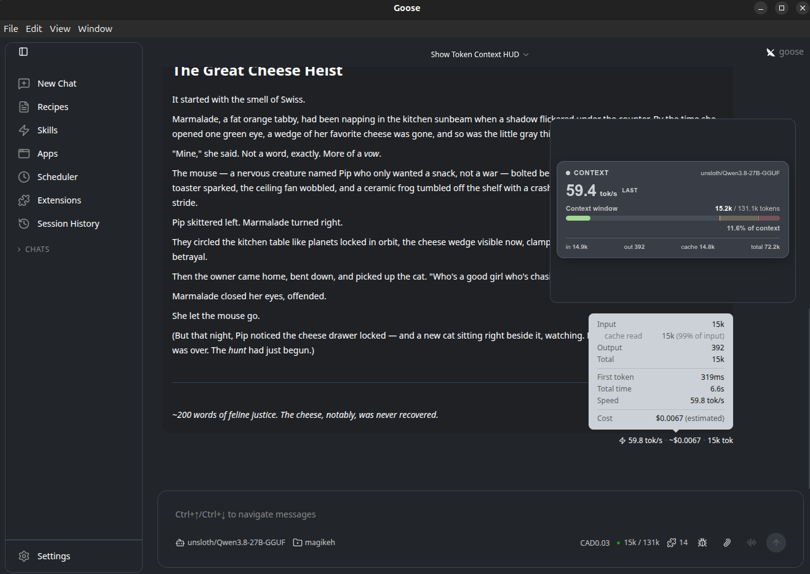
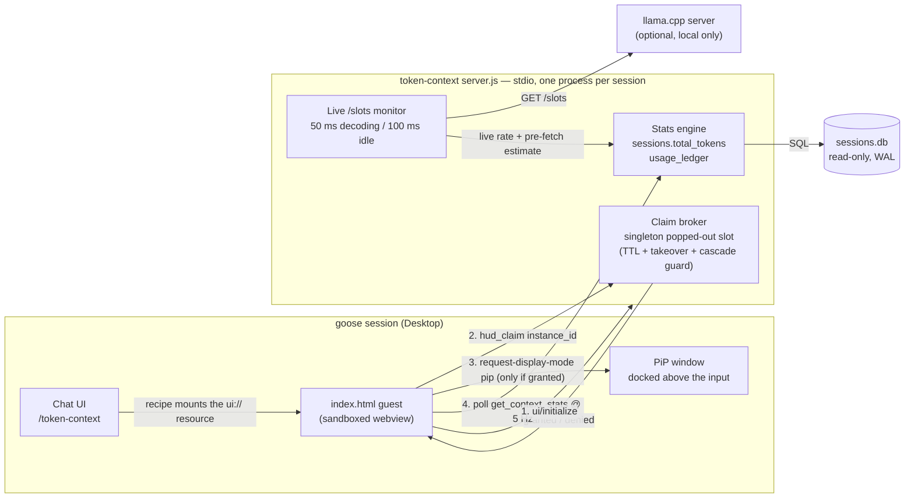

# Token Context
**Watch your goose session spend tokens in real time — pinned above the chat input, not buried in a footer.**

Token Context is a small [goose MCP App](https://goose-docs.ai/docs/tutorials/building-mcp-apps) that pins a compact HUD into your chat's Picture-in-Picture slot, docked just above the input box displaying
- Realtime LLM Tokens generated per second.
- Context window usage, limits, and compaction threshold.
- Aggregrated input, cached, and output tokens for the entire session
It automatically updates metrics **5 times per second**, responds to theme switches, remembers if it was open between relaunches, and is all controlled by a single slash command!


## Screenshots



## What it shows

- **tok/s** — rolling output-token rate over the last 30 s of completed responses. For local llama.cpp servers it's a *live* per-token feed from the model server's own `/slots` counter, with a streaming dot while a response is in flight. States: `live` (decoding) → `warming` (prompt phase) → `last` (idle, last completed response) → 30 s rolling fallback.
- **used / window** — the active session's current context size (e.g. `31,994 / 200,000`) with a color-coded progress bar: green below the warn trigger, amber between the triggers, red at/above the auto-compaction point. The bar carries 1 px ticks at both triggers and zone tints on the empty track, so the colour-change points stay visible as it fills.
- **footer** — input / output / cache-read tokens and the session's accumulated total.

## Requirements

- **Node.js ≥ 22.5** — the server uses the built-in `node:sqlite`; nothing is compiled
- **goose Desktop** with MCP App / Picture-in-Picture support
- **Optional:** a local llama.cpp server (only needed for the live per-token tok/s feed; without it the HUD shows last-completed-response rates)

## Install

### 1. Get the code
```sh
git clone https://github.com/YOUR_USERNAME/token-context.git ~/.config/goose/extensions/token-context && cd $_
pwd -P #Save this output to clipboard for setting up the extension in the goose UI
```

### 2. Install dependencies (no build step)
```sh
npm install
```
That's the whole build. There is no compile or transpile step — `server.js` is plain ESM and `index.html` is a static document. `node_modules/` **is** a runtime dependency (the server imports `@modelcontextprotocol/sdk` from it), so keep it in place.

### 3. Register the extension in goose
**Via the UI:** open the sidebar (panel button, top-left) → **Extensions** → **Add custom extension**, then fill in:

| Field       | Value 
| ----------- | ----- 
| Name        | `Token Context` 
| Type        | `Standard IO` 
| Description | `Live tokens/sec and context window usage HUD, pinned above the chat input` 
| Command     | `node /home/$MY_USERNAME/.config/goose/extensions/token-context/server.js` 

Any environment variables from the table below go in the modal's environment-variable fields.

**Or drop this in your `~/.config/goose/config.yaml`:**

```yaml
extensions:
  token-context:
    type: stdio
    name: token-context
    display_name: Token Context
    enabled: false
    cmd: node
    args: ["/home/$MY_USERNAME/.config/goose/extensions/token-context/server.js"]
    envs: {}
    env_keys: []
    timeout: 300
```

### 4. Install the recipe (for `/token-context` slash command)
**Via the UI:** sidebar → **Recipes** → **Import Recipe** → under *Recipe File* choose `~/.config/goose/extensions/token-context/recipes/show-hud.yaml` → **Import Recipe**. Then in **Recipes**, find *Show Token Context HUD*, click the terminal icon next to it, type `token-context` (no leading slash), and **Save** — that assigns the slash command to the recipe.

**Or in `~/.config/goose/config.yaml`** (this also skips the import step entirely):
```yaml
slash_commands:
  - command: token-context
    recipe_path: /home/$MY_USERNAME/.config/goose/extensions/token-context/recipes/show-hud.yaml
```

### 5. Restart goose
New stdio extensions load at startup.
From then on, `/token-context` works in any session — the recipe is self-healing: if the extension is disabled in a session, the command re-enables it first, then pins the HUD.

### Environment variables (all optional)
Nothing is required — the extension runs fine with zero configuration.
Set any of these in the extension's environment (UI modal or `envs:` in `config.yaml`):

| Variable                      | Default                                                                               | Purpose
| ----------------------------- | ------------------------------------------------------------------------------------- | -------
| `GOOSE_CONTEXT_WINDOW`        | auto (custom-provider table → built-in model table → local-provider config → 200000)  | Context window in tokens for the active model. Custom OpenAI-compatible providers don't publish a window, so set this for an exact figure.
| `GOOSE_SESSIONS_DB`           | auto-discovered (`~/.local/share/goose/sessions/sessions.db`)                         | Explicit path to the goose session store.
| `GOOSE_CUSTOM_PROVIDERS_DIR`  | `~/.config/goose/custom_providers`                                                    | Where custom provider JSON files live (context-window lookup by provider + model).
| `GOOSE_CONFIG_PATH`           | `~/.config/goose/config.yaml`                                                         | goose config file — used to read `GOOSE_AUTO_COMPACT_THRESHOLD` and local-model context sizes.
| `GOOSE_SLOTS_URL`             | derived from the custom provider's `base_url` (`""` disables)                         | llama.cpp `/slots` endpoint for the live per-token tok/s feed.
| `GOOSE_SLOT_POLL_MS`          | 100                                                                                   | `/slots` poll cadence (ms) while no slot is processing.
| `GOOSE_SLOT_ACTIVE_POLL_MS`   | 50 (capped at the idle cadence)                                                       | `/slots` poll cadence (ms) while a slot is decoding.
| `GOOSE_TPS_OFFSET_MS`         | 0                                                                                     | Constant (ms) added to the hand-off duration when computing the idle **last** rate — calibrates the HUD to goose's footer timer, which includes client-side overhead the model-server window doesn't (≈120 measured on one local llama.cpp setup).
| `GOOSE_HUD_CLAIM_TTL_MS`      | 3000                                                                                  | Liveness TTL (ms) for the popped-out HUD slot.
| `GOOSE_HUD_CLAIM_TAKEOVER_MS` | 10000                                                                                 | How old (ms) a holder's claim must be before a fresh HUD self-init takes over the popped-out slot.
| `AGENT_SESSION_ID`            | `null`                                                                                | **NOT** a user setting — goose injects it into each session's stdio process, and it's what scopes the HUD to the chat it was pinned in.

## Using it
**The primary method is via the slash command.** In any chat session, type:
```
/token-context
```
The recipe enables the extension in this session if needed, mounts the HUD, and asks goose to report current stats.
The HUD pops out into a Picture-in-Picture window docked just above the chat input and updates every 200 ms.

Behaviour worth knowing:

- **Re-triggering** `/token-context` pops a *new* HUD and takes over the popped-out slot; the previous one degrades to a compact inline placeholder — "*Token Context — HUD already pinned in this session*".
- The **✕ on the PiP window only minimizes** the HUD back to inline; the guest stays alive and keeps polling, and the next `/token-context` pops a fresh window.
- **Theme switches** (light/dark/aura/system) re-render the whole chat — the claim protocol makes sure exactly one popped-out window survives.

**Other ways to trigger it:**
- Ask in natural language — *"show the context HUD"* — and the model calls the `token-context__show_context_hud` tool.
- Call the tools directly from any recipe or agent:
  - `show_context_hud` — mount the HUD
  - `get_context_stats` — stats on demand; takes an optional `session_id` to inspect *other* chats
  - `hud_claim` — the popped-out slot broker (used internally by the HUD at self-init)

## Technical dive
### Folder structure
| Path                                 | What it is 
| ------------------------------------ | --- 
| `server.js`                          | The MCP stdio server — stats engine, live `/slots` monitor, claim broker, 3 tools + the `ui://` HTML resource. Single file, no build step. 
| `index.html`                         | The HUD itself — one self-contained HTML/CSS/JS document, the guest side of the MCP App protocol. 
| `recipes/show-hud.yaml`              | The self-healing entry-point recipe behind `/token-context`. 
| `test-client.mjs`                    | MCP protocol smoke test (tools, stats shape, resource, claim protocol). 
| `test-hud-client.mjs`                | Headless functional test of the HUD script (stub DOM + fake host). 
| `package.json` / `package-lock.json` | ESM project; the only dependency is `@modelcontextprotocol/sdk`. 

### Components and how they talk

**`server.js` — the MCP stdio server.** Goose spawns one process per session and injects `AGENT_SESSION_ID`. The server opens `sessions.db` **read-only** (WAL mode, so concurrent reads never block goose's writes) and builds stats from three sources:

- `sessions.total_tokens` — the authoritative *used* figure for the tracked session (written by goose at response-completion boundaries).
- `usage_ledger` — one row per completed LLM response; source of the rolling tok/s and the idle **last** rate.
- A live monitor that polls a local llama.cpp server's `/slots` endpoint adaptively (50 ms while a slot is decoding, 100 ms idle), turning the model server's own `n_decoded` counter into a real-time tok/s plus a pre-fetched context estimate. At the idle boundary it hands the final decoded count and millisecond-resolution elapsed time over to the ledger, so the idle rate matches goose's footer timer closely (`stats.lastSource` reports `handoff` vs `db`).

It also hosts the **claim broker**: an in-memory singleton per session that arbitrates who may hold the popped-out state. Guests call `hud_claim` with a per-load `instance_id`; the broker grants the slot if unheld, takes it over once a holder's claim ages past the takeover window, denies rapid successive claims (the theme-switch remount cascade), and expires dead holders by TTL.

To goose it exposes three tools — `show_context_hud`, `get_context_stats`, `hud_claim` — plus one resource: `ui://token-context/hud` (mimeType `text/html;profile=mcp-app`), which serves `index.html`.

**`index.html` — the sandboxed guest.** When goose mounts the resource, the guest boots and speaks the MCP App protocol: `ui/initialize` → `initialized`, then it calls `hud_claim` **before** requesting any display mode. Only a guest whose own init was *granted* requests `ui/request-display-mode { mode: "pip" }`; everyone else renders inline with the placeholder. From then on a 200 ms loop polls `get_context_stats` (carrying the `instance_id`) and renders: tok/s with its state dot, the context bar with trigger ticks, and the token footer. Polls report `pipClaim` — a guest that was *granted* at init but is *denied* on a poll (a new HUD took over) best-effort requests `inline` to close its own popped window. The guest mirrors the host's resolved theme (initial context + live `host-context-changed` events) and reports a display-mode-aware size — natural content height inline, the fixed 400×300 PiP frame (minus border) popped out. If `hud_claim` is unavailable (older server), the guest fails open to the legacy unconditional pip request.

**`recipes/show-hud.yaml` — the entry point.** A deliberately dumb recipe: if `token-context__*` tools are absent it enables the extension via `extensionmanager__manage_extensions`, then calls `show_context_hud` and `get_context_stats` and reports the numbers. Because goose re-reads recipe files from disk on every invocation, recipe changes need no restart.



### Limitations
- **tok/s granularity for remote providers.** goose writes `sessions.db` only at response-completion boundaries, so for API providers the HUD shows the last completed response's rate (tagged `last`) while idle. Local llama.cpp servers get a genuine live feed via `/slots` — but the slot is per-server, not per-session (goose's background calls light it up too), so the live estimate is only trusted while the slot's measured prompt size correlates with the tracked session's context size (±25 %, min 8 k tokens); at completion the authoritative DB value snaps back in.
- **PiP placeholder.** While the HUD is popped out, goose shows a small "Playing in Picture-in-Picture" placeholder in the chat flow at the spot where the HUD would have been inline. That's the closest built-in way to pin the panel above the input without modifying goose.
- **Context window for custom providers is an estimate** unless you set `GOOSE_CONTEXT_WINDOW`.
- **The HUD tracks the most recently updated user session** — in practice the active one.
- **The PiP frame is a fixed 400×300 on the goose side**; the HUD fills it cleanly rather than floating with margins.

## Further reading
- [CHANGELOG.md](docs/CHANGELOG.md) — version history
- [DEVELOPMENT.md](docs/DEVELOPMENT.md) — testing and reloading the extension after code changes
- [Building MCP Apps (goose docs)](https://goose-docs.ai/docs/tutorials/building-mcp-apps)


## Credits
Vibed with love by unsloth/Qwen3.8-27B[UD-Q4_K_XL]